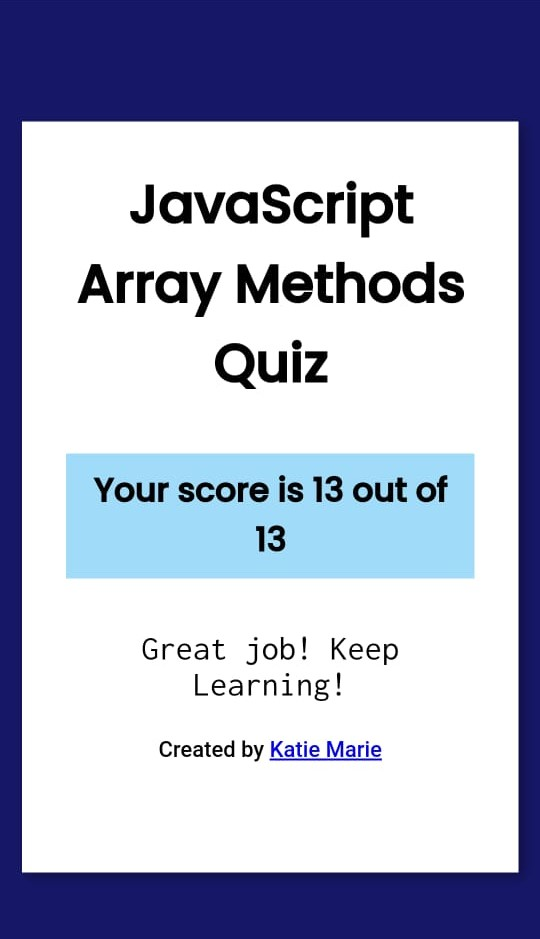

#
# 1.Write short notes on Array methods write code example
# 1:
-  push()

- The push() method adds new items to the end of an array. The push() method changes the length of the array.

```js
let arr=[1,2,3,4]
arr.push(5)
console.log(arr);

```

# 2 :
-  pop()
The pop() method removes the last element from an array and returns that value to the caller.
```JS
let arr = [1,2,3,4,5]
arr.pop()
console.log(arr);
```   
# 3 : 
- The shift() method removes the first element from an array and returns that removed element.
```js
let arr = [1,2,3,4,5]
arr.shift()
console.log(arr);

```

# 4 :
- The unshift() method adds new elements to the beginning of an array. The unshift() method overwrites the original array.

```js
let arr = [1,2,3,4,5]
arr.unshift(0)
console.log(arr);

```
# 5 :
- The includes() method is a built-in JavaScript function that checks if a specific element or substring is present in an array or a string, respectively.

```js
let ara = [1,2,3,4,5]
console.log(ara.includes(5));

```
# 6 :
- The toString() method is used internally by JavaScript when an object needs to be displayed as a text (like in HTML), or when an object needs to be used as a string. Normally, you will not use it in your own code.

```js
let ara = [1,2,3,4,5]
console.log(ara.toString());

```
# 7 :
- The reverse() method returns reference to the original array, so mutating the returned array will mutate the original array as well.

```js
let arr = [1,2,3,4,5]
console.log(arr.reverse());

```
# 8 :
- The join() method of Array instances creates and returns a new string by concatenating all of the elements in this array, separated by commas or a specified separator string.

```js
 let arr = ["subin","sarath"]
 console.log(arr.join("-"));
```
# 9 :
- The concat() method concatenates (joins) two or more arrays. The concat() method returns a new array, containing the joined arrays.

```js
let arr = ["subin","sarath"]
let join = arr.concat(arr1)
let arr1 = [12,13,46,48,87,78,7]
console.log(join);
```
# 10 :
- The flat() method is a built-in JavaScript method that flattens the input array into a new array.

```js
let arr =[["Subin","Anu"],["Ankush"],["janmani","shyam"]]
console.log(arr.flat())

```
# 11 :
- The slice() method extracts a part of a string. The slice() method returns the extracted part in a new string. The slice() method does not change the original string. 

```js 
let animals = ["Dog","Cat","Rat","Elephent"]
console.log(animals.slice(2));
```
# 2. Quiz

# 3.Write a JavaScript function to check whether an `input` is an array
- 
```js
let myNumber= [1,2,3,4,5,6]

let isArray =(arr)=>{
return Array.isArray(arr)
}
let  result = isArray(myNumber)
console.log(result);
``` 
# 4.Write a JavaScript function that takes an array as an argument and returns the first element of the array.
- 
```js
let arr =[1,2,3,4,5,6,7]

let firstElement=((array)=>{
    return array.shift()
})
let result = firstElement(arr)
console.log(result);
```
# 5.Write a JavaScript function that takes an array as an argument and returns the last element of the array.
-
```js

let arr = [1,2,3,4,5,6,7]

let lastElement=((array)=>{
    return array.pop()
})
let result = lastElement(arr)
console.log(result);
```

# 6.Write a simple JavaScript function to join all elements of the following array into a string.
-
```js
let arr = ["Red", "Green", "White", "Black"]

let lastElement=((array)=>{
    return array.join(" ")
    
})
let result = lastElement(arr)
console.log(result);
```

# 7. Write a JavaScript program that accepts a number as input and inserts dashes (-) between each. For example, if you accept 025468 the output should be 0-2-5-4-6-8
-
```js
let number = 12072003
let converstion=(num)=>{
let change = String(num).split("").map((item)=>{
return Number(item)
})
return change.join("-")
}
console.log(converstion(number));

```

# 8.Write a JavaScript function that checks if the given number is even or odd then returns a Boolean value (use: arrow function, return keyword, ternary operator)
-
```js
let number = 10

let isEven=(num)=>{
num%2===0 ? console.log("true") :
console.log("false");
}
isEven(number)
```

# 9.Create an array of guestlist. Write a javascript function that takes the user’s name as an argument and checks if it is there in the guestlist. If yes, return the string “Welcome” else, return “Sorry, good luck next time”.
-
```js
let guests = ["subin","anu","sarath","sujith"]

let greeting=(names)=>{
return names.includes("sarath")?console.log("welcome"):console.log("Sorry good luck next time");
}
greeting(guests)
```

# 10 Write a java script function  that reverses a given number example : 123456789 => 987654321
(split()),reverse (),join ()
-
```js
let number= 123456789
let numRevese=(num)=>{
let outPut = String(number).split("").reverse().join("")
console.log(outPut);
}
numRevese(number)
```
# 11.Write a JavaScript function that accepts a string as a parameter and converts the first letter into upper case.Example: “Javascript” => “Javascript”
-
```js
let languageName = "javascript"
let bigLettetrName =(str)=>{
let firstLetter = str.slice(0,1).toUpperCase()
let restOfTheLetterstr = str.slice(1,str.length).toLowerCase()
let reflectName =firstLetter+restOfTheLetterstr
return reflectName

}
console.log(bigLettetrName(languageName));
```


